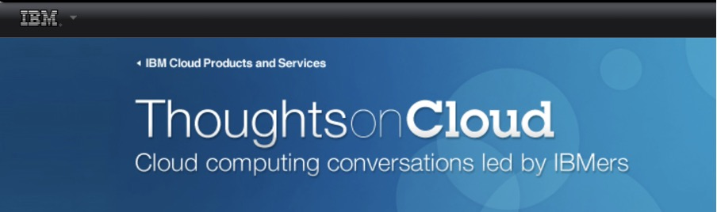
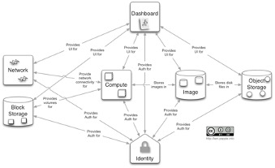

# OpenStack release 'Folsom', first thoughts

**Author:** Marco Celon  
**Published on:** October 24, 2012  
**Time:** 1:20 PM  
**Web Address:** http://thoughtsoncloud.com/index.php/2012/10/openstack-release-folsom-first-thoughts

---

## Article Reference: Thoughts on Cloud

*IBM Cloud Products and Services - Cloud computing conversations led by IBMers*

---

## OpenStack release "Folsom", first thoughts

The OpenStack project has delivered the "Folsom" release of its cloud controller. The "Folsom" release has more than 185 new features and enhancements developed by more than 350 [open source developers](http://www.openstack.org/).

As you can see from the [release notes](http://docs.openstack.org/folsom/content/), we now have two new core projects: Quantum and Cinder.

- **Quantum** provides a feature-rich and extensible API for managing advanced configurations by utilizing plugins and it supports true multi-tenancy without any restrictions of VLANs. The driving force of this new core project was Nova, a contribution of the OpenVSwitch virtual switch which was acquired by VMware in July, just a couple of months before joining the Open Stack Foundation.

- **Cinder** is the OpenStack Block Storage project that was a feature of the Nova compute controller (nova-volume). To be noted that OpenStack started out with an object-based storage system that was great for storing and retrieving large blobs of data, however it was not as efficient for use at the core computing system for rapidly changing data, and that is the main reason behind the birth of Cinder. Of course the Swift project will continue to be developed.

With these two new core [projects](http://www.openstack.org/projects/) the overall conceptual architecture has been modified:

*OpenStack Folsom Architecture Overview*

---

## Other interesting innovations in the new release

- **A host aggregation feature has been added to Nova** so that the module is now able to look at the available pools of CPUs and coprocessors and dispatch work to the right set of hardware within a pool. (Nova)

- **PKI Support for authentication** (Keystone)

- **It is now possible to connect to a slated server and collect real-time metrics for improved operations.** (Swift)

The Folsom release has been packaged up on the current 12.04 and impending 12.10 releases of Ubuntu Linux from Canonical, and in the Fedora 17 and Fedora 18 development [Linuxes](http://fedoraproject.org/) from Red Hat.

The new release is also seeing active contribution from IBM itself as OpenStack is seen as enhancing its SmartCloud Foundation offerings by expanding support for different hypervisors at the Infrastructure as a Cloud layer. The main areas of IBM support were:

- Contributing to the robustness and stability of many of the OpenStack projects, including [Nova](http://www.openstack.org/projects/) (compute), [Glance](http://www.openstack.org/projects/) (image service), [Cinder](http://www.openstack.org/projects/) (storage), [Horizon](http://www.openstack.org/projects/) (dashboard) and [Tempest](http://www.openstack.org/projects/) (integration test).

- Supporting the building of the complete system stack for OpenStack documentation and to the translations for Simplified Chinese.

- Helping to provide a dynamic hypervisor support for the OpenStack Nova (compute) component.

- Contributing to the development and optimization of OpenStack on the KVM hypervisor.

- Drivers for Power Systems and Storwize storage offerings included in the [Folsom release](http://www.openstack.org/releases/folsom/).

- Contributed to integration tests for the XML APIs.

- Contributing to the implementations of both SNA's Cloud Data Management Interface (CDMI) and the DMTF's Cloud Infrastructure Management Interface (CIMI) standards to the OpenStack third party repository.

To mention, finally, that [IBMers](https://www.openstack.org/community/members/) have been accepted as OpenStack core contributors.

---

## About Marco Celon

Marco is an IBM cloud delivery specialist and has been involved with several cloud proposals in SW Europe and in MEA. He is involved with a private cloud implementation (Infrastructure on Demand) in Australia. He recently relocated to Australia from Italy.

---

*This blog post was originally published on Thoughts on Cloud, an IBM Cloud Products and Services platform for cloud computing conversations led by IBMers.*
