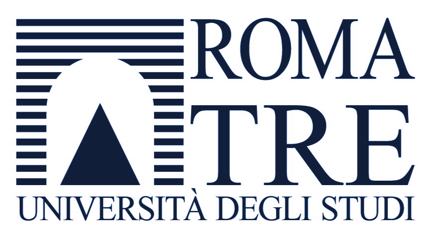

# Master in IT Governance - IBM and Roma Tre University Collaboration

---

## Academic-Industry Partnership

The **Master in Governo dei Sistemi Informativi** (Master in IT Governance: Development, Management, and Monitoring) represented a strategic collaboration between **IBM Italia**, **Formit Servizi**, and **Università degli Studi Roma Tre** (Roma Tre University). This second-level master's program was designed to bridge academic knowledge with industry practice, preparing IT professionals for leadership roles in the evolving landscape of information systems governance.

**Program Period:** 2009-2010 (Second Edition)  
**Completion Date:** April 15, 2011  
**Institution:** Faculty of Engineering, Roma Tre University  
**Industry Partners:** IBM Italia, Formit Servizi

---

## Program Overview

### Educational Objectives

The Master's program aimed to develop specialized professionals capable of managing complex IT organizations through strategic and consultative approaches in both corporate and public administration contexts. The curriculum focused on creating IT leaders with multi-dimensional expertise:

#### Technical Dimension
Advanced capabilities in applying innovative solutions across critical business areas including:
- **Service-Oriented Architecture (SOA)** implementation and governance
- **Information Technology** infrastructure management and optimization
- **Process engineering** with system architecture aligned to state-of-the-art "Service Oriented Architecture"
- Security infrastructure design and implementation
- Technology innovation assessment and adoption strategies

#### Economic and Managerial Dimension  
Strategic competencies in organizational leadership:
- **IT Governance frameworks** for complex organizations leveraging modern technologies
- **Service management** innovation and optimization
- **Supplier relationship management** and vendor evaluation
- **Contract monitoring** and compliance management
- **Quantitative methodologies** for investment evaluation and cost-benefit analysis
- ROI and business value assessment of IT initiatives

---

## Program Structure

### Coordination and Faculty

**Academic Coordination:**
- **Prof. Paolo Atzeni** (Coordinator, Università Roma Tre)
- **Prof. Luca Cabibbo** (Università Roma Tre)
- **Prof. Giuseppe Di Battista** (Università Roma Tre)
- **Prof. Riccardo Torlone** (Università Roma Tre)

**Industry Representatives:**
- **Ing. Vincenzo Aquaro** (Formit Servizi)
- **Dott.ssa Carmela Pierri** (Formit Servizi)
- **Ing. Raffaele Belli** (IBM Italia)

### Course Details

**Start Date:** January 21, 2010 (Sede Formit di Via Conti Rossini, 38)  
**Academic Year:** 2009-2010  
**Program Level:** Second-level Master (II Livello)  
**Credits:** Advanced post-graduate professional qualification

**Schedule Information:**
- First period classes concluded: Friday, March 19, 2010
- Second period classes commenced: Thursday, April 8, 2010
- Intensive development period: June 24-26 (no classes), resuming July 1, 2010
- Extended program through September 30, 2010
- Final presentations and assessments: November 2010

---

## Curriculum Focus Areas

### Core Competencies Developed

1. **Strategic IT Planning**
   - Alignment of IT strategy with business objectives
   - Enterprise architecture frameworks
   - Digital transformation roadmaps

2. **Service Management and ITIL**
   - IT Service Management (ITSM) best practices
   - Service catalog design and implementation
   - Incident, problem, and change management

3. **IT Governance Frameworks**
   - COBIT (Control Objectives for Information and Related Technologies)
   - IT compliance and audit practices
   - Risk management and control frameworks

4. **Architecture and Infrastructure**
   - Service-Oriented Architecture (SOA) principles
   - Enterprise integration patterns
   - Infrastructure optimization and consolidation

5. **Project and Portfolio Management**
   - IT project governance
   - Portfolio prioritization methodologies
   - Agile and traditional project management approaches

6. **Procurement and Vendor Management**
   - IT sourcing strategies
   - Contract negotiation and management
   - Service Level Agreement (SLA) design and monitoring

---

## IBM Italia's Role and Contribution

### Industry Leadership

IBM Italia served as a primary industry partner, contributing:

- **Subject Matter Experts:** Senior IBM consultants and architects as guest lecturers
- **Real-World Case Studies:** Enterprise IT governance scenarios from IBM client engagements
- **Technology Insights:** Exposure to IBM's enterprise software portfolio (Tivoli, WebSphere, Information Management)
- **Best Practices:** IBM's internal IT governance methodologies and frameworks
- **Career Development:** Professional networking and mentorship opportunities

### Strategic Context

This collaboration aligned with IBM's broader commitment to:
- **Professional Development:** Supporting continuous education in the IT community
- **Academic Partnerships:** Bridging the gap between academic theory and industry practice
- **Talent Development:** Cultivating future IT leaders familiar with enterprise technologies
- **Knowledge Transfer:** Sharing decades of IBM's IT governance experience with emerging professionals

---

## Final Thesis and Certification

*Master in IT Governance Certificate - April 15, 2011*

### Thesis Work

**Title:** [Final Thesis Document](./assets/files/master-itgov-final-thesis.pdf)

The culminating thesis integrated academic research with practical application, demonstrating mastery of IT governance principles within real-world organizational contexts. The work synthesized:
- Theoretical frameworks studied throughout the program
- Industry best practices from IBM and partner organizations
- Original analysis and recommendations for IT governance challenges
- Application of quantitative methodologies to business scenarios

### Completion and Recognition

**Certification Date:** April 15, 2011  
**Awarding Institution:** Università degli Studi Roma Tre  
**Faculty:** Facoltà di Ingegneria (Faculty of Engineering)  
**Program Title:** Master di II livello in Governo dei Sistemi Informativi

---

## Academic Excellence and Industry Recognition

### Program Distinction

The Roma Tre Master program was recognized for:
- **Academic Rigor:** Integration of computer science, information systems, and business management
- **Industry Relevance:** Curriculum designed in collaboration with leading IT organizations
- **Practical Application:** Balance of theoretical foundations with hands-on experience
- **Professional Network:** Access to faculty and industry leaders in Italian IT community

### Career Impact

The Master's program provided:
- **Advanced Credentials:** Recognized qualification for IT governance and management roles
- **Specialized Knowledge:** Deep expertise in service-oriented architectures and IT governance frameworks
- **Professional Network:** Connections with Roma Tre faculty, IBM professionals, and fellow students
- **Career Advancement:** Foundation for strategic IT leadership positions

---

## Program Context within IBM Journey

### Timeline Integration

The Master's program (2009-2011) occurred during the **IBM Italia period** (August 2006 - July 2010) and extended into the **IBM Middle East period** (August 2010 - February 2012), demonstrating:

- **Commitment to Continuous Learning:** Pursuing advanced education while maintaining full-time IBM responsibilities
- **Strategic Professional Development:** Aligning academic study with cloud computing and IT governance career trajectory
- **Global Perspective:** Applying Italian academic training to international IBM roles across EMEA and MEA regions
- **IBM Support:** Organization's encouragement of employee education and professional advancement

### Complementary Certifications

The Master's curriculum complemented concurrent IBM professional development:
- **IBM IT Specialist Profession** (December 2009) - Professional recognition during Master's studies
- **Cloud Computing Architecture certification** (May 2011) - Shortly after Master's completion
- **Tivoli and SmartCloud certifications** - Technical depth supporting governance knowledge
- **IT Service Management courses** - Alignment with ITSM components of Master's program

---

## Legacy and Gratitude

### Academic Appreciation

This Master's program represents gratitude to:
- **Università Roma Tre Faculty:** Professors who brought academic rigor and industry insight to complex IT governance topics
- **IBM Italia Mentors:** Ing. Raffaele Belli and other IBM professionals who contributed expertise and guidance
- **Formit Servizi:** Partnership in creating a world-class professional development program
- **Fellow Students:** Peer learning and collaboration that enriched the educational experience

### Enduring Value

The knowledge and frameworks gained through this program continued to inform:
- **IT Strategy Development:** Application of governance principles to cloud computing initiatives
- **Service Management:** ITIL and ITSM practices in OpenStack and SmartCloud projects
- **Architecture Decisions:** SOA principles applied to enterprise infrastructure design
- **Leadership Approaches:** Strategic thinking developed through case studies and project work

---

## Program Information and Resources

### Official Details

**Website:** [http://masteritgov.dia.uniroma3.it](http://masteritgov.dia.uniroma3.it)  
**Email:** masteritgov@dia.uniroma3.it  
**Department:** Dipartimento di Informatica e Automazione (Department of Computer Science and Automation)  
**Faculty Page:** [Università degli Studi Roma Tre - Facoltà di Ingegneria](http://www.ing.uniroma3.it)

### Partner Organizations

- **IBM Italia:** [http://www.ibm.com/it](http://www.ibm.com/it)
- **Formit Servizi:** Industry training and professional development organization
- **Roma Tre University:** [http://www.uniroma3.it](http://www.uniroma3.it)

---

## Reflection

This Master's program exemplified the collaborative spirit between academia and industry—a partnership that enriched both theoretical understanding and practical application. The experience of studying IT governance while simultaneously implementing enterprise systems at IBM created a unique synthesis of knowledge that informed years of subsequent work in cloud computing, infrastructure management, and technology leadership.

The program stands as a testament to IBM Italia's investment in employee development and Università Roma Tre's commitment to producing industry-ready IT professionals. It represents not just an academic achievement, but a pivotal chapter in professional growth made possible by organizations that valued continuous learning and the mentors who supported that journey.

---

*This Master's program was completed during IBM Italia tenure (2009-2011) as part of continuous professional development, supported by IBM's commitment to employee education and career advancement.*
