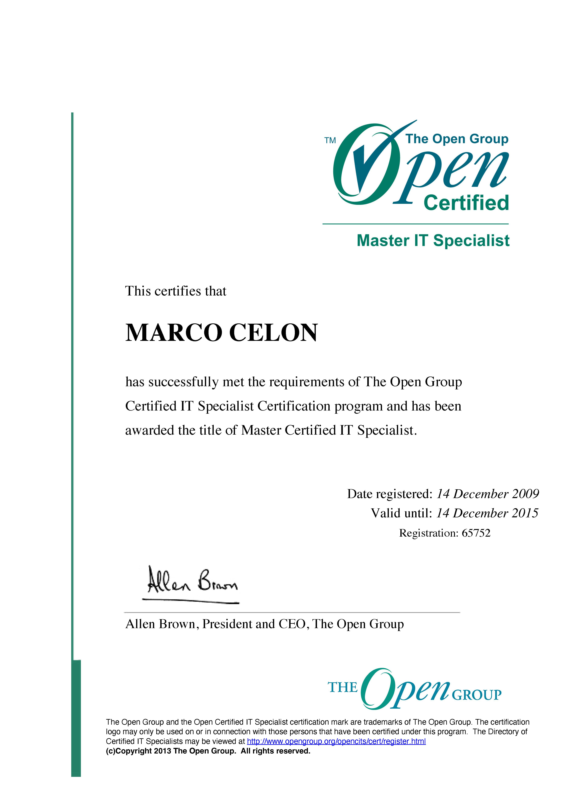

[← Back to README](../../README.md)

Documentation of IBM IT Specialist Profession Certification and The Open Group Master Certified IT Specialist designation achieved December 14, 2009. These credentials represented industry recognition during the late 2000s for systems management and infrastructure specialization. Like the certifications of that era, they reflect a specific moment in technology history—proprietary platforms and frameworks that have largely given way to open-source and cloud-native paradigms.

---

## Certifications

| IBM IT Specialist Profession | The Open Group Master Certified IT Specialist |
|:-:|:-:|
|  |  |
| *IBM Certified Professional - IT Specialist Profession (December 14, 2009)* | *The Open Group Master Certified IT Specialist (Registration 65752)* |

---

## The IBM IT Specialist Profession

### What is the IBM IT Specialist Profession Certification?

The **IBM IT Specialist Profession** was a certification framework introduced by IBM in the mid-2000s as part of the company's professional development structure. This certification represented recognition of expertise across technical and business domains within IBM's ecosystem at that time.

### Structure and Recognition

- **Professional Credentialing:** A framework that recognized professionals working across multiple technical areas
- **Experience-Based:** Required demonstrated professional experience and successful project delivery
- **Peer Recognition:** Included endorsements from colleagues and managers
- **Multi-Dimensional Assessment:** Combined technical knowledge with practical client engagement experience

### Requirements

To achieve the IBM IT Specialist Profession certification, candidates typically needed to:

1. Complete multiple technical certifications in their specialty area
2. Demonstrate significant professional experience
3. Show a track record of successful project work
4. Receive management endorsement
5. Pass professional competency assessments

---

## The Open Group Master Certified IT Specialist

### About The Open Group Certification

**The Open Group** is an international consortium working on open standards for IT systems. Their certification programs represented industry-recognized credentials spanning multiple vendors.

### The Master IT Specialist Designation

The **Master Certified IT Specialist** represented The Open Group's advanced IT Specialist certification and signified recognition of IT systems expertise across multiple platforms.

**Registration Number:** 65752  
**Valid Period:** December 14, 2009 - December 14, 2015

---

## Certification Details

### IBM IT Specialist Profession
- **Awarded:** December 14, 2009
- **Certifying Body:** IBM - IT/7 Specialist Profession
- **Executive Authority:** Kim Bourbeau, IBM WorldWide IT Specialist Profession Executive

### The Open Group Master Certified IT Specialist
- **Awarded:** December 14, 2009
- **Valid Until:** December 14, 2015
- **Registration:** 65752
- **Certifying Authority:** Allen Brown, President and CEO, The Open Group

---

*IBM IT Specialist Profession and Open Group Master IT Specialist certification documentation*
