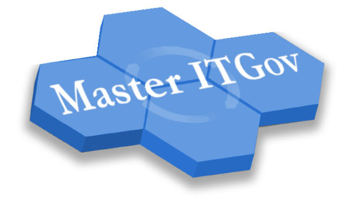
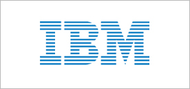
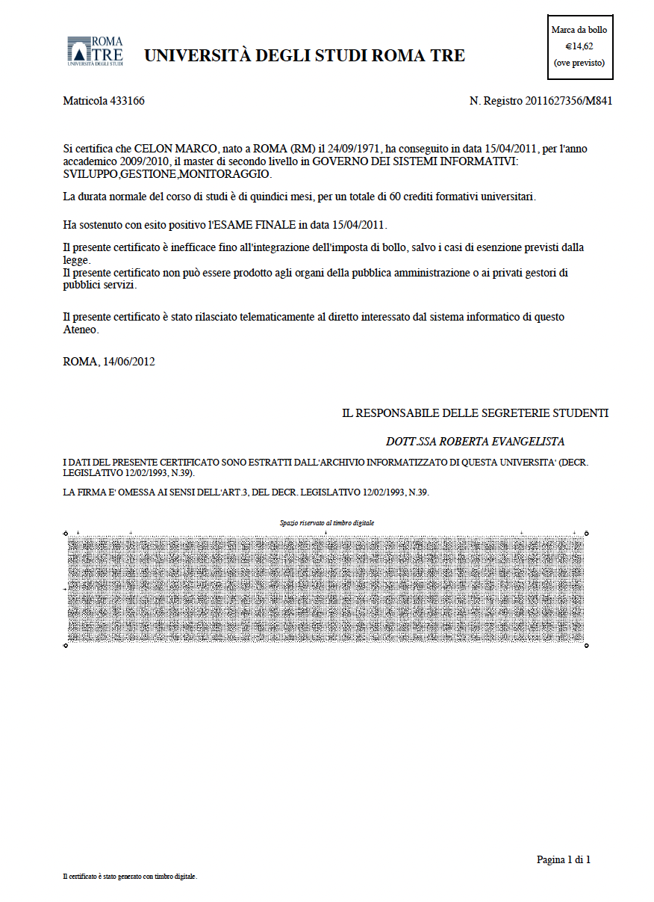

[← Back to README](../../README.md)

### Academic Partnership & Program Identity

<table style="border: none; padding: 20px;">
<tr style="border: none;">
<td width="25%" style="border: none; text-align: center; padding: 10px;">
 
<em style="font-size: 0.9em;">Roma Tre University</em>
</td>
<td width="25%" style="border: none; text-align: center; padding: 10px;">
 
<em style="font-size: 0.9em;">Master Program</em>
</td>
<td width="25%" style="border: none; text-align: center; padding: 10px;">
 
<em style="font-size: 0.9em;">Cohort & Collaboration</em>
</td>
<td width="25%" style="border: none; text-align: center; padding: 10px;">
 
<em style="font-size: 0.9em;">Institution Digital</em>
</td>
</tr>
</table>

---

## Academic-Industry Partnership

The **Master in Governo dei Sistemi Informativi** (Master in IT Governance) was a second-level master's program developed through collaboration between **IBM Italia**, **Formit Servizi**, and **Università degli Studi Roma Tre**. The program aimed to combine academic rigor with industry practice, bringing IT professionals and business leaders into dialogue around information systems governance.

**Program Period:** 2009-2010 (Second Edition)  
**Completion Date:** April 15, 2011  
**Institution:** Faculty of Engineering, Roma Tre University  
**Industry Partners:** IBM Italia, Formit Servizi

---

## Program Overview

### Curriculum Focus

The Master's program covered:

#### Technical and Strategic Areas
- Service-Oriented Architecture (SOA) principles and implementation
- IT infrastructure management and design
- Security architecture and implementation
- Technology assessment and adoption

#### Organizational and Managerial Areas
- IT Governance frameworks for complex organizations
- Service management practices and optimization
- Vendor and supplier management
- IT investment evaluation and business value assessment

---

## Program Structure

### Coordination and Faculty

**Academic Coordination:**
- **Prof. Paolo Atzeni** (Coordinator, Università Roma Tre)
- **Prof. Luca Cabibbo** (Università Roma Tre)
- **Prof. Giuseppe Di Battista** (Università Roma Tre)
- **Prof. Riccardo Torlone** (Università Roma Tre)

**Industry Representatives:**
- **Ing. Vincenzo Aquaro** (Formit Servizi)
- **Dott.ssa Carmela Pierri** (Formit Servizi)
- **Ing. Raffaele Bella** (IBM Italia)

### Course Details

**Start Date:** January 21, 2010 (Sede Formit di Via Conti Rossini, 38)  
**Academic Year:** 2009-2010  
**Program Level:** Second-level Master (II Livello)  
**Credits:** Advanced post-graduate professional qualification

**Schedule Information:**
- First period classes concluded: Friday, March 19, 2010
- Second period classes commenced: Thursday, April 8, 2010
- Intensive development period: June 24-26 (no classes), resuming July 1, 2010
- Extended program through September 30, 2010
- Final presentations and assessments: November 2010

---

## Curriculum Focus Areas

### Topics Covered

1. **IT Governance and Strategy**
   - Enterprise IT planning and alignment
   - Governance frameworks and standards

2. **Service Management**
   - IT Service Management (ITSM) practices
   - Service design and delivery

3. **IT Architecture**
   - Enterprise architecture principles
   - Infrastructure design

4. **Management and Leadership**
   - Project and portfolio management
   - Vendor and risk management

5. **Professional Skills**
   - Strategic communication
   - Business and financial analysis

---

## Program Partners

### IBM Italia's Involvement

IBM Italia participated as an industry partner, contributing:
- Subject matter experts and guest lecturers
- Real-world case studies and scenarios
- Exposure to enterprise technology platforms
- Professional networking opportunities

---

## Final Thesis and Certification

*Master in IT Governance Certificate - April 15, 2011*

### Thesis Work

The culminating thesis synthesized program learning with IT governance principles and practical organizational scenarios.

**Thesis Document:** [Final Thesis](../../assets/files/certifications/master-itgov-final-thesis.pdf)

### Completion

**Certification Date:** April 15, 2011  
**Institution:** Università degli Studi Roma Tre  
**Degree:** Master di II livello in Governo dei Sistemi Informativi

---

---

## Program Information and Resources

### Official Details

**Website:** [http://masteritgov.dia.uniroma3.it](http://masteritgov.dia.uniroma3.it)  
**Email:** masteritgov@dia.uniroma3.it  
**Department:** Dipartimento di Informatica e Automazione (Department of Computer Science and Automation)  
**Faculty Page:** [Università degli Studi Roma Tre - Facoltà di Ingegneria](http://www.ing.uniroma3.it)

### Partner Organizations

- **IBM Italia:** [http://www.ibm.com/it](http://www.ibm.com/it)
- **Formit Servizi:** Industry training and professional development organization
- **Roma Tre University:** [http://www.uniroma3.it](http://www.uniroma3.it)

---

*This Master's program was completed during IBM Italia tenure (2009-2011). It represented a meaningful intersection of academic study and industry practice during that period.*
